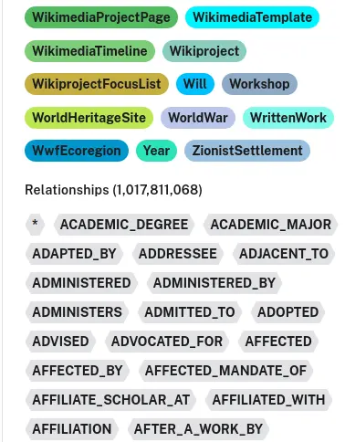
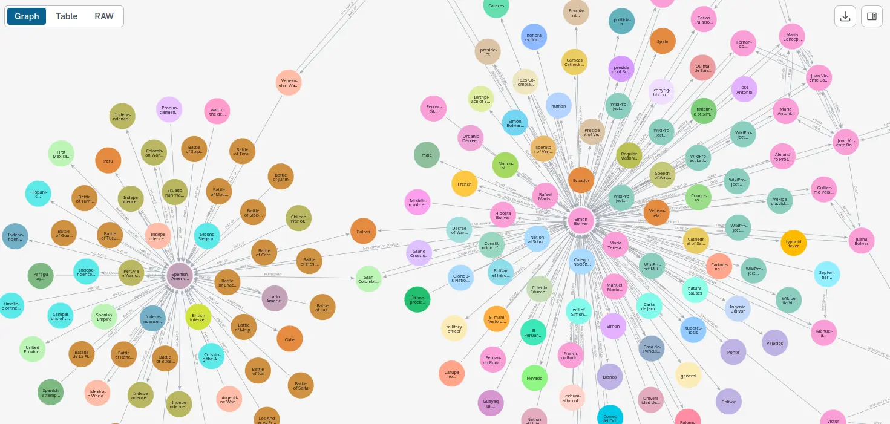

Fixing duplicate edges was a long process, but it is now mostly done. All messages have been processed, and the code now uses only edges with `statement_id`. For the final part, I need to remove all edges without `statement_id`. This should reduce the total number of edges by roughly half, and we are currently at a little over `one billion`.

I'm not in a hurry to remove these edges because all applications are already ignoring duplicates. I'm trying to find a way to avoid blocking the database during cleanup, since I still want to run import jobs and other queries. I'll probably write a worker that keeps running and removes edges in batches.

I think the next step toward proper synchronization with `wikidata` is removing nodes that were deleted from `wikidata`. I'll keep you updated!
