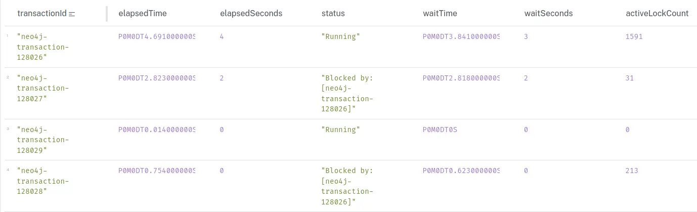

Fixing the duplicate edges is taking longer than I expected. The dump file processing finished within the estimated time, but the edge worker(s) are taking a long time to process the new edges. There are currently a bit more than `800k` messages, at around `500` edges per message. I've changed the number of workers from 5 to 1, as I could see many locks slowing down the process.

When running this query:

```cypher
SHOW TRANSACTIONS
YIELD transactionId, elapsedTime, status, waitTime, activeLockCount, currentQuery
RETURN
  transactionId,
  elapsedTime,
  elapsedTime.seconds AS elapsedSeconds,
  status,
  waitTime,
  waitTime.seconds AS waitSeconds,
  activeLockCount
ORDER BY elapsedSeconds DESC;
```

I see transactions holding locks that other transactions are waiting for.




I don't see blocked transactions now, but this is going to take a long time to finish. I'll need to think about how I can improve this process. I wasn't counting on different messages trying to modify the same nodes.

Once this is done, I'll start deleting all edges without `statement_id`. That would reduce the number of edges by half. We're currently at `600M` edges, so that would be a big improvement.