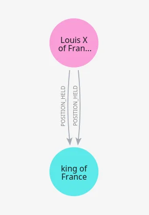
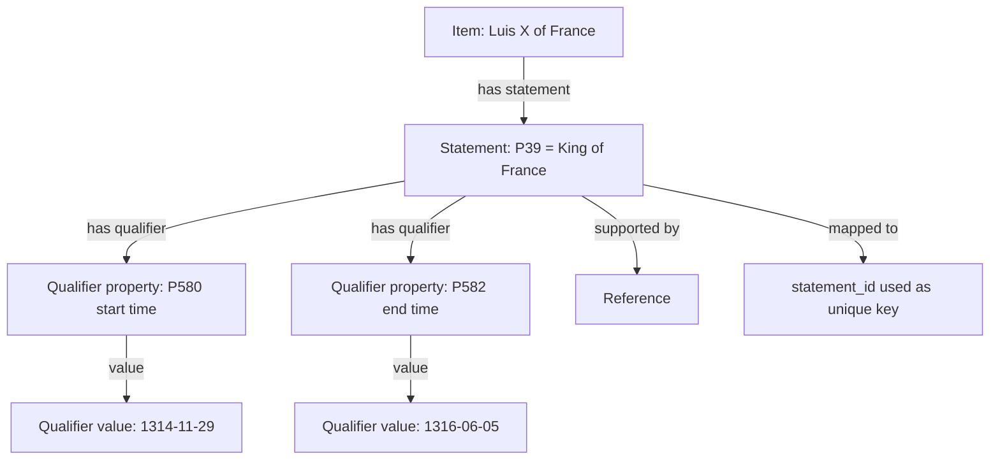

Back to the Wikidata dump file processing: the edge de-duplication script ran and got rid of a bit more than 1 million edges. But while navigating some timelines, I noticed I still had plenty of duplicates. I kept seeing the same person in the same role in the same year (like [Luis X of France](https://timeline.cronologia.co.uk/role/kings-of-france-Q18384454#7) as #7 and #8).

Checking that node and its edges in `neo4j`, I found I had 2 `POSITION_HELD` edges with slightly different dates: same year and month, but different start and end days. Looking at the same node in `Wikidata`, I could only see one statement.

## Quick Wikidata Data Structure

Basically, my edge de-duplication strategy was pretty bad. I was only looking at property type + start date. That allows, for example, the same person to have 2 terms as president (same `POSITION_HELD`, different start dates), which is valid. But if someone corrected a date in `Wikidata` before a second dump import, I'd end up with 2 `POSITION_HELD` edges for the same person and position, just with different dates, like in the *Luis X of France* example above.

So I came up with a plan: use the `Wikidata` statement ID as the de-duplication key. That way I'll always update the same edge for the same statement.

This requires a phased process:

## Part 1

A temporary first step to stop even more duplication in my [timeline](https://timeline.cronologia.co.uk) and [family tree](https://familytree.cronologia.co.uk) websites: change the services to ignore any edge where `statement_id` is `null`. That way I can start creating brand-new edges with `statement_id` and be sure they won't be duplicated, while I work on the next phase.

## Part 2

Modify scripts and workers to save `statement_id` on edges, and use that for de-duplication instead of start date.

## Part 3

Deploy Part 1 and Part 2 changes and process the massive `Wikidata` dump file again.

## Part 4

Once the new dump file is processed, modify all services again to show only edges with a `statement_id` property. Once I'm happy with the results, proceed to Part 5.

## Part 5

Remove all edges without a `statement_id` property, since those were created with the old de-duplication strategy and are likely duplicated.

I'm currently on *Part 3*, processed up to line `9,672,263`. Still plenty of lines to go to get to 120M+. I'll share more updates as I go!

