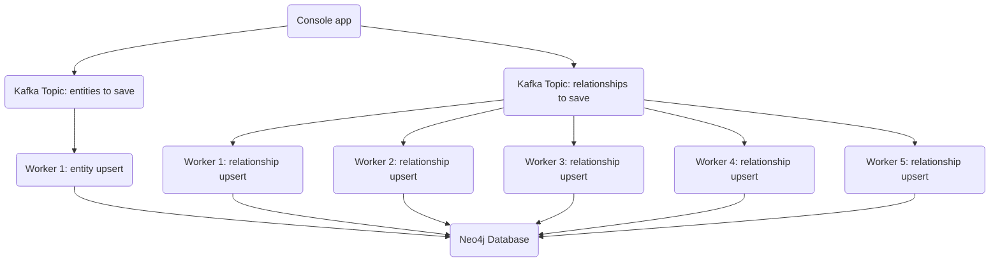

I'll keep talking about the Wikidata dump and my setup. Overnight, we went from 16 million nodes and 56 million relationships ([See yesterday's post](/post/wikidata-dumps-and-neo4j)) to 38.5 million nodes and 84.5 million relationships. I'm watching disk space closely; I've used 25%, so I have 144 GB left.

Wikidata has an estimated 110 million Q entities. It'll take around 4-5 days to process nodes. There are way more relationships, and the queue is already behind by 1.2 million messages with 5 workers. Entity upsert is quicker; the worker is lagging by 3k messages with 1 worker. Each message in our topic contains a batch of entities/relationships, so the actual number of entities/relationships is higher than the message count. I'm reusing the architecture I had set up for the import while using the API, so currently it goes something like this:

I ended up buying a 2TB SSD to replace the current one. I don't want to rebuild that machine, so I'm going to follow the advice of *you know who* and use a tool called [dd](https://en.wikipedia.org/wiki/Dd_(Unix)) to clone the current disk to the new one, and then swap the disks. I'll have to stop the workers while I do this, but the console app can keep running and sending messages to our topics.

Hopefully, my next update will be that the disk upgrade went well and we are back to processing messages. I also need to start thinking about how to optimize the import process if I plan to do this every week (that's how often Wikidata releases new dump files).