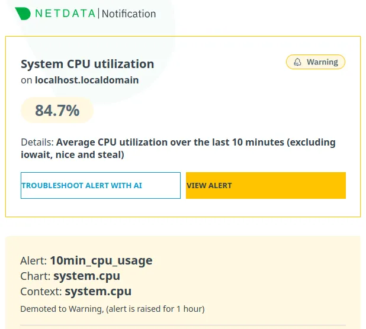
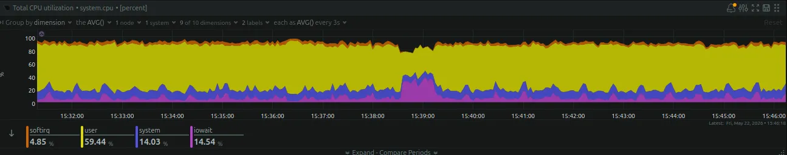

Okay, not much to update. I had a couple of problems with the script: I noticed I was creating duplicate relationships (I was comparing the wrong thing in the merge). So I had to stop the import script and resume it after making changes, but that means I now have to run some cleanup scripts to remove duplicates. It is annoying because the database is big now, so I need to find a good way to do it.

Some updated numbers:

* `53.5` million nodes
* `218` million relationships
* `7k` messages behind in the nodes topic
* `600k` messages behind in the relationships topic
* I've used `5%` of the new disk (around `83.5 GB`)

Forgot to mention: I keep receiving alerts from Netdata about CPU usage on the box running the script. It seems that streaming BZ2 line by line is quite CPU-intensive. I might need to run this from a different box as well, as it is currently running on the same box as Neo4j, which is not ideal.

